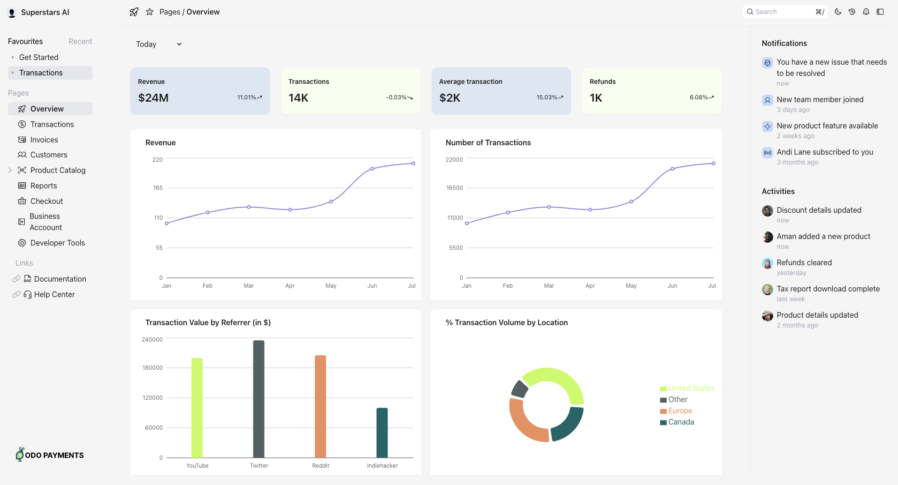
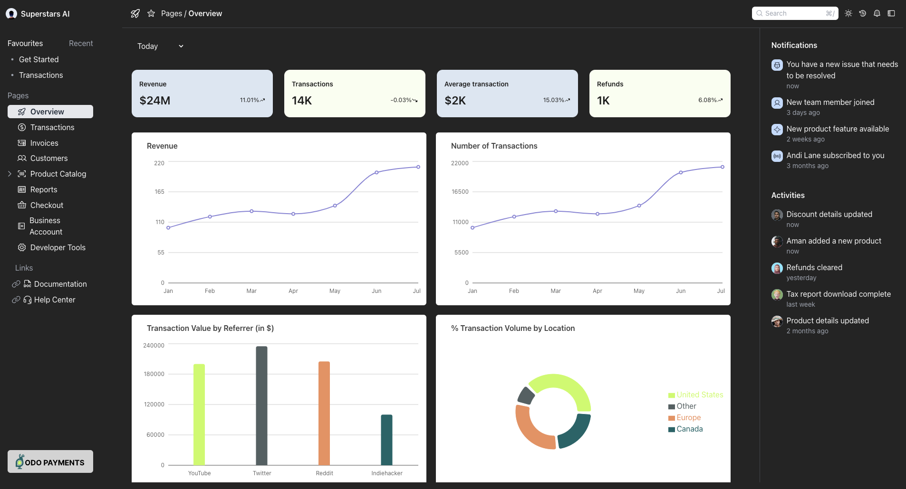
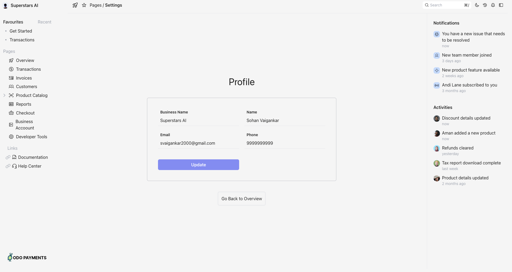

# Tempdashh

## Deployment Link - [https://tempdashh.vercel.app](https://tempdashh.vercel.app)

Tech Stack and packages

- [x] Reactjs
- [x] TypeScript
- [x] TailwindCSS
- [x] Recharts
- [x] Vercel - for deployment

### To run the project locally

1. simply clone this github repository on your local machine
2. navigate to the cloned repo using cd command in terminal
3. ensure that you're running node v18 or above
4. execute following command in the directory

   ```js
   npm install && npm run dev
   ```

5. follow the instructions on terminal, by default your application shall be running on [http://localhost:5173](http://localhost:5173)

- screenshots







- [Sohan Vaigankar](https://peerlist.io/sohan) - svaigankar2000@gmail.com
